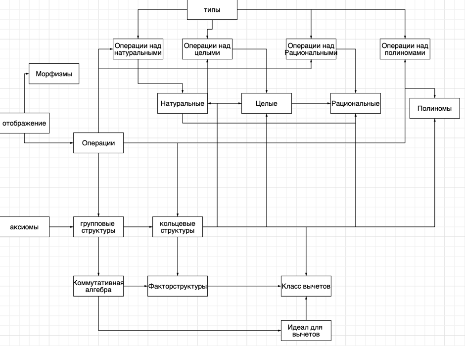

# О структуре программы.
> В данной директории находится основное ядро всей программы.
> Оно разделено на два логических подуровня - абстрактная алгебра, и реализация
> конкретных типов математических объектов.

## Abstract
В данной директории объявлены основные аксиомы, как концепты, они проверяют что аксиома действительно выполняется
а именно. Основная часть выполнимости аксиомы лежит на ПОЛЬЗОВАТЕЛЕ! А именно, базовым операциям присваиваются тэги,
которые навешивает сам программист, и если какой либо тэг есть на операции, то свойство 
которым обозначается тэг - выполняется. \
Программа основана на принципе абстрактной алгебры, то есть, роль множеств играют введенные типы, которые, как бы, 
описывают основные характеристики, например вот базовый типо Natural 
```c++
struct Natural {
    std::vector<uint8_t> nums; 

    Natural(const std::vector<uint8_t>& nums_i) : nums(nums_i) {
        while (nums.size() > 1 && nums.back() == 0) {
            nums.pop_back();
        }
        
        if (nums.empty()) {
            nums.push_back(0);
        }
    }
};
```
В нем нету продвинутых операций, он просто существует, и все операции описываются уже над ним. То есть,
Вводится понятие отображения, затем от отображения создаются бинарные и унарные операции, и они уже как раз являются
некоторыми шаблонами для создания арифметических операций. \
Базовый класс отображения
```c++
template<typename Derived, typename Output, typename... Inputs>
class Mapping {
public:
    static Output execute(Inputs... args) {
        return Derived::calc(args...);                          // Любое количество параметров, конечно, по опеределени
    }                                                           // отображение сопоставляет 1 элемент другому, но для
};    
```

И уже от него создается бинарная операция

```c++
template<typename Derived, typename T>
class BinaryOperation : public Mapping<Derived, T, T, T> {};
```

 От которой мы создаем операции над эти множеством.
 ```c++
 class Add : public BinaryOperation<Add, Natural>, 
            public Associative, 
            public Commutative, 
            public Identity
{
public:
    static Natural calc(Natural num1, Natural num2) { 
        size_t n = num1.nums.size();
        size_t m = num2.nums.size();
        size_t maxlen = std::max(n, m);
        std::vector<uint8_t> res;
        res.reserve(maxlen + 1);
        uint8_t carry = 0;
        for (size_t i = 0; i < maxlen; ++i) {
            uint8_t a = (i < n) ? num1.nums[i] : 0;
            uint8_t b = (i < m) ? num2.nums[i] : 0;
            uint8_t s = a + b + carry;
            res.push_back(s % 10);
            carry = s / 10;
        }
        if (carry) res.push_back(carry);
        return Natural(res); 
    }
};
 ```

И таким образом стоиится программа. То есть, описывается базовый тип, затем создаются отдельно операции для него, и затем, 
создается класс, которые при помощи операцтором c++ является интерфейсом для того чтобы все конкретно работало. \
Ниже приведен пример класса натуральных чисел.
```c++
class N {
private:
    Natural value;

public:
    // Определяем типы операций для концептов
    using AdditionOp = NatOper::Add;
    using MultiplicationOp = NatOper::Mul;
    using SetType = Natural;

    N(Natural v) : value(std::move(v)) {}
    N(const std::vector<uint8_t>& nums) : value(nums) {}


    N operator+(const N& other) const {
        return N(NatOper::Add::execute(value, other.value));
    }

    N operator*(const N& other) const {
        return N(NatOper::Mul::execute(value, other.value));
    }

    N operator-(const N& other) const {
        return N(NatOper::Sub::execute(value, other.value));
    }

    N operator/(const N& other) const {
        return N(NatOper::Div::execute(value, other.value));
    }

    N operator%(const N& other) const {
        return N(NatOper::Rem::execute(value, other.value));
    }

    bool operator>(const N& other) const {
        return NatOper::Cmp::execute(value, other.value) == 2;
    }

    bool operator<(const N& other) const {
        return NatOper::Cmp::execute(value, other.value) == 1;
    }

    bool operator==(const N& other) const {
        return NatOper::Cmp::execute(value, other.value) == 0;
    }

    static N gcd(const N& a, const N& b) {
        return N(NatOper::Gcd::execute(a.get(), b.get()));
    }

    static N lcm(const N& a, const N& b) {
        return N(NatOper::Lcm::execute(a.get(), b.get()));
    }


    static N zero() { return N({0}); }
    static N identity() { return N({1}); }

    const Natural& get() const { return value; }

    std::string toString() const {
        return NatOper::toString::execute(value);
    }
};

```

Замечу, что наличие using обязательно! так как при помощи них концепты проверяются, что данный класс является полем. То беж
вот так выглядит концепт проверки того что класс является полем 
```c++
template<typename T, typename AddOp, typename MultOp>
concept Field = 
    UnitaryRing<T, AddOp, MultOp> && 
    AbelianGroup<T, MultOp>;
```

В свою очередь, на примере полиномов, мы их можем сделать на любом поле! поэтому необходимо, чтобы тип, который мы туда
предаем был полем
```c++
template<typename T>
requires Field<typename T::SetType, typename T::AdditionOp, typename T::MultiplicationOp>
struct Polynomial {
    using SetType = typename T::SetType;
    std::vector<T> coefficients;  // Коэффициенты [a0, a1, a2, ...]

	Polynomial(const std::vector<T>& coeffs) : coefficients(coeffs) {
		T zero = T::zero();

		// Удаляем ведущие нули
		while (coefficients.size() > 1 && coefficients.back() == zero) {
			coefficients.pop_back();
		}

		// Полином должен иметь хотя бы один коэффициент
		if (coefficients.empty()) {
			coefficients.push_back(zero);
		}
	}
    /**
     * @brief Степень полинома
     */
	size_t degree() const {
		T zero = T::zero();

		if (coefficients.size() == 1 && coefficients[0] == zero) {
			return 0;
		}
		return coefficients.size() - 1;
	}
};

```

То есть можно заметит, что основные операции зависят от человека. Если человек навешивает тэги, реализации которых нету, то программа
просто не скомпелируется, и не будет работать. То есть, если добавляется тэг нейтрального элемента, то в классе должен быть 
метод, выдавающий нейтральных элемент.



Структура того как устроен проект